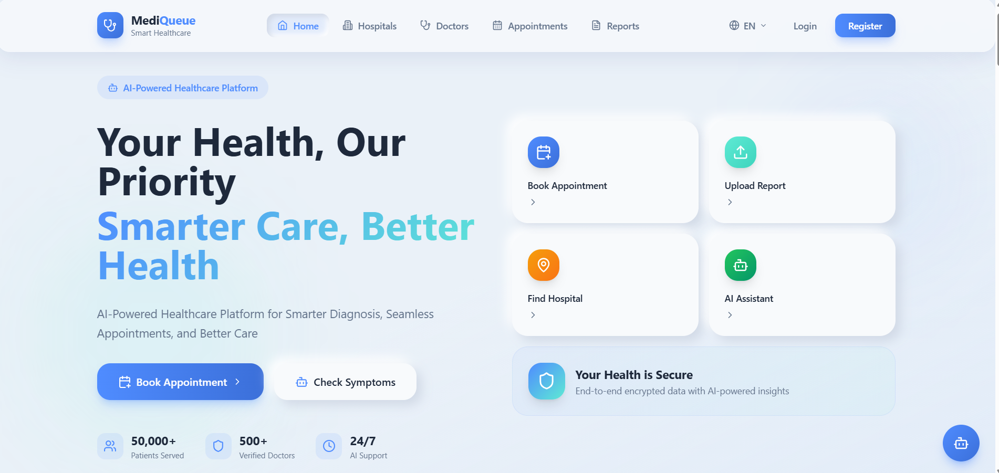

# MediQueue



**Smart Healthcare — Your Health, Our Priority. Smarter Care, Better Health.**

🔗 **Live Demo:** https://mediqueuecsp.vercel.app/

MediQueue is an AI-powered healthcare platform built for smarter diagnosis, seamless appointment booking, and better patient care. It connects patients, doctors, and hospital admins in a single role-based system with real-time scheduling, medical report management, and an AI symptom checker.

---

## ✨ Features

- 🏥 **Hospital & Doctor Directory** — Browse hospitals and verified doctors, view details, and find the right care.
- 📅 **Appointment Booking** — Real-time, atomic slot booking with doctor schedules and shift management.
- 🤖 **AI Symptom Checker / Assistant** — Chatbot-based AI assistant for preliminary symptom analysis.
- 📄 **Medical Reports** — Upload, store, and view patient medical reports and summaries.
- 👨‍⚕️ **Role-Based Dashboards** — Separate experiences for **Patients**, **Doctors**, and **Admins**.
- 📝 **Digital Prescriptions** — Doctors can write and manage prescriptions.
- 🔐 **Secure Authentication** — Login, registration, password reset, and OTP verification (multi-channel).
- 🛡️ **RBAC & Row-Level Security** — Fine-grained access control enforced via Supabase RLS policies.
- 🔔 **Notifications** — In-app notifications for appointments and approvals.
- 🌐 **Responsive UI** — Clean, modern, neumorphic-inspired design built with Tailwind CSS.

---

## 🧰 Tech Stack

**Frontend**
- [React 18](https://react.dev/) + [TypeScript](https://www.typescriptlang.org/)
- [Vite](https://vitejs.dev/) — build tool & dev server
- [React Router v7](https://reactrouter.com/) — routing
- [Tailwind CSS](https://tailwindcss.com/) — styling
- [Framer Motion](https://www.framer.com/motion/) — animations
- [Lucide React](https://lucide.dev/) — icons
- [Recharts](https://recharts.org/) — charts & analytics
- [React Google Maps API](https://www.npmjs.com/package/@react-google-maps/api) — hospital location maps
- [jsPDF](https://github.com/parallax/jsPDF) + [html2canvas](https://html2canvas.hertzen.com/) — PDF/report generation

**Backend / Data**
- [Supabase](https://supabase.com/) — PostgreSQL database, authentication, storage, and Row-Level Security

**Tooling**
- ESLint + TypeScript ESLint
- PostCSS + Autoprefixer

---

## 📁 Project Structure

```
mediqueue/
├── src/
│   ├── components/
│   │   ├── chatbot/       # AI assistant / chatbot UI
│   │   ├── dashboard/     # Dashboard widgets (e.g. appointment timeline)
│   │   ├── home/          # Landing page sections (hero, services, stats, etc.)
│   │   ├── layout/        # Navbar, Footer, Layout wrapper
│   │   └── ui/            # Reusable UI primitives (cards, buttons, badges)
│   ├── contexts/          # Auth & Language React contexts
│   ├── hooks/             # Data hooks (appointments, doctors, hospitals, slots, etc.)
│   ├── lib/                # Supabase client setup
│   ├── pages/
│   │   ├── admin/          # Admin dashboard
│   │   ├── auth/           # Login, register, password reset
│   │   ├── doctor/         # Doctor dashboard, schedule, prescriptions
│   │   └── patient/        # Patient dashboard, hospitals, doctors, appointments, reports
│   ├── types/               # Shared TypeScript types
│   ├── utils/                # Helper utilities (i18n, class merging, etc.)
│   ├── App.tsx
│   └── main.tsx
├── supabase/
│   └── migrations/         # SQL migrations (schema, RBAC, RLS, OTP, scheduling)
├── index.html
├── vite.config.ts
├── tailwind.config.js
└── vercel.json
```

---

## 🚀 Getting Started

### Prerequisites
- [Node.js](https://nodejs.org/) (LTS recommended)
- A [Supabase](https://supabase.com/) project (URL + anon key)

### Installation

```bash
# Clone the repository
git clone https://github.com/<your-username>/mediqueue.git
cd mediqueue

# Install dependencies
npm install
```

### Environment Variables

Create a `.env` file in the project root:

```env
VITE_SUPABASE_URL=your_supabase_project_url
VITE_SUPABASE_ANON_KEY=your_supabase_anon_key
```

### Database Setup

Run the SQL migrations in `supabase/migrations/` (in order) against your Supabase project via the Supabase SQL editor or CLI to set up the schema, RBAC policies, appointment lifecycle, OTP verification, and storage buckets.

### Run Locally

```bash
npm run dev
```

The app will be available at `http://localhost:5173`.

### Other Scripts

```bash
npm run build      # Production build
npm run preview    # Preview the production build
npm run lint        # Run ESLint
npm run typecheck   # TypeScript type checking
```

---

## 🌍 Deployment

MediQueue is deployed on **Vercel**: https://mediqueuecsp.vercel.app/

The included `vercel.json` handles SPA routing rewrites so client-side routes resolve correctly on refresh/direct navigation.

---

## 👥 User Roles

| Role | Access |
|------|--------|
| **Patient** | Book appointments, view doctors/hospitals, manage reports, use the AI symptom checker |
| **Doctor** | Manage schedule, view appointments, write prescriptions |
| **Admin** | Manage hospital-wide operations and approvals |

---

## 📊 Platform Highlights

- 50,000+ Patients Served
- 500+ Verified Doctors
- 24/7 AI Support
- End-to-end encrypted data with AI-powered insights

---

## 📄 License

This project is currently private/unlicensed. Add a license of your choice if you plan to open-source it.

